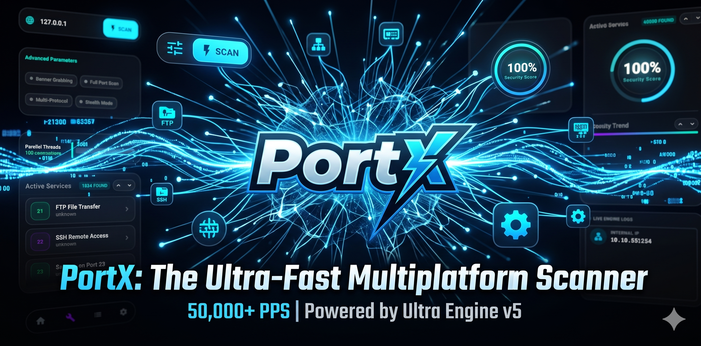

# PortX: Ultra-Fast Network Port Scanner (KMP)
## 🚀 Powered by the "Ultra Engine" v5.0.0

---

### [فارسی] معرفی پروژه
**PortX** یک اسکنر پورت شبکه فوق سریع، امن و چند پلتفرمی است که با استفاده از **Kotlin Multiplatform** توسعه یافته است. این پروژه با بهره‌گیری از موتور اختصاصی **Ultra Engine**، استانداردهای جدیدی را در سرعت (۵۰,۰۰۰ پورت در ثانیه) و امنیت تعریف می‌کند.

### [English] Project Overview
**PortX** is an ultra-fast, secure network port scanner built with **Kotlin Multiplatform (KMP)**. Powered by the custom **Ultra Engine v5**, it redefines network exploration with neural-inspired adaptive timing and extreme throughput (50,000+ PPS).

---

## 📸 Interface Preview | پیش‌نمایش محیط برنامه

  

---

## 💎 Elite Features | قابلیت‌های کلیدی

| Feature | Technical Excellence | توضیحات فنی |
| :--- | :--- | :--- |
| **Ultra Engine v5** | Neural-inspired adaptive scanning logic. | موتور هوشمند با منطق تطبیقی عصبی. |
| **Adaptive RTT** | Moving average timeout adjustment (2.5x RTT). | تنظیم هوشمند تایم‌اوت بر اساس تاخیر لحظه‌ای. |
| **Turbo Mode** | High-throughput bursting (50,000+ PPS). | اسکن با نرخ بسیار بالا (بیش از ۵۰ هزار پورت). |
| **Security Hardened** | Aggressive R8/ProGuard obfuscation & Anti-RE. | امنیت بالا و مقاوم‌سازی در برابر مهندسی معکوس. |
| **Decoupled Pool** | Zero-blocking scanner vs banner worker logic. | جداسازی کامل بخش اسکن از تشخیص سرویس. |
| **Memory Safety** | Bounded Channels preventing OOM during 65k scans. | مدیریت امن حافظه در اسکن‌های عظیم. |

---

## 🛠 Technical Architecture & Security | معماری فنی و امنیت

### 1. Neural-Inspired Adaptive Timing (تایمینگ هوشمند)
**[EN]** Using a 2.5x moving average of **Round Trip Time (RTT)**, the engine dynamically adjusts timeouts.  
**[FA]** با استفاده از میانگین متحرک ۲.۵ برابری **RTT**، تایم‌اوت‌ها به صورت لحظه‌ای تنظیم می‌شوند.

### 2. Security Hardening (امنیت و مقاوم‌سازی)
**[EN]** Advanced R8/ProGuard rules protect Koin DI, Serialization models, and internal domain logic.  
**[FA]** قوانین پیشرفته R8/ProGuard از تمام بخش‌های منطقی و امنیتی برنامه محافظت می‌کنند.

---

## 🚀 Native Distribution | خروجی‌های بومی
- **Android**: Signed APK with Adaptive Icons.
- **Windows**: Professional `.msi` installers.
- **macOS/Linux**: Native support via Compose Multiplatform.

---

Developed with ❤️ by **[mr-coder20](https://github.com/mr-coder20)**
